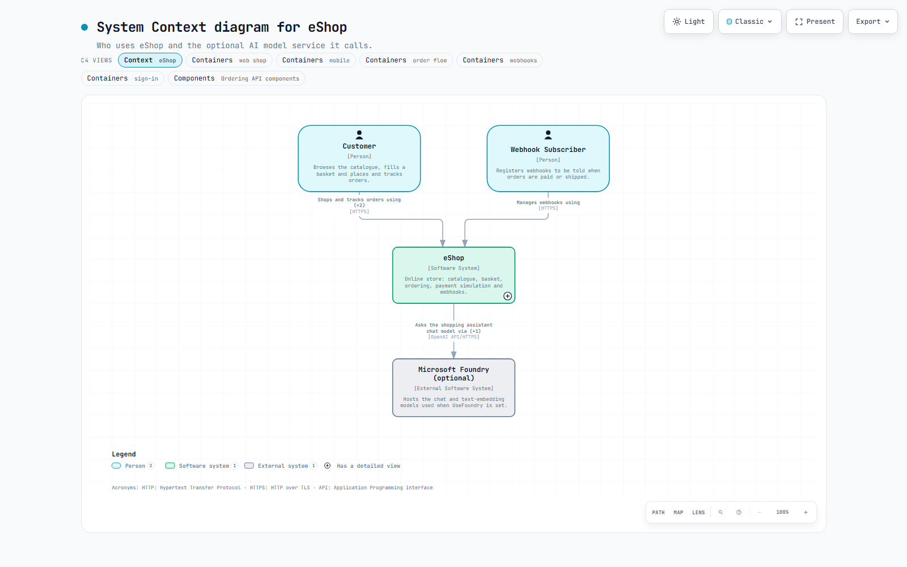
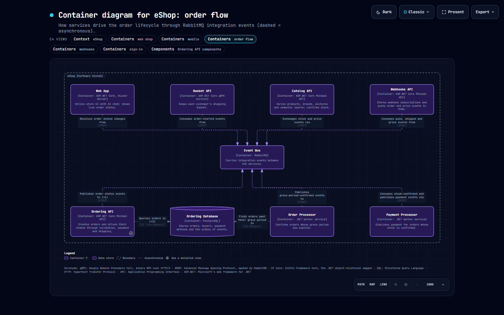
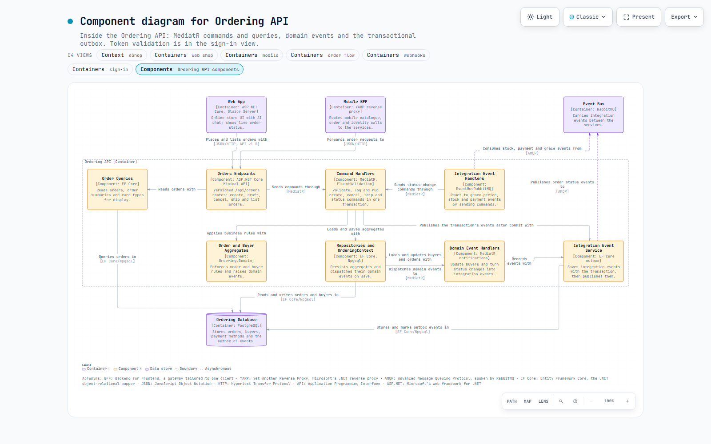
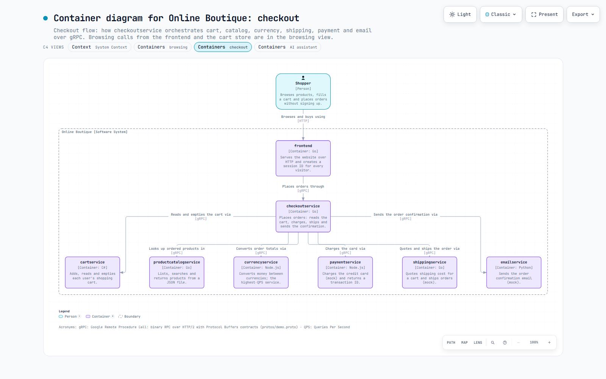
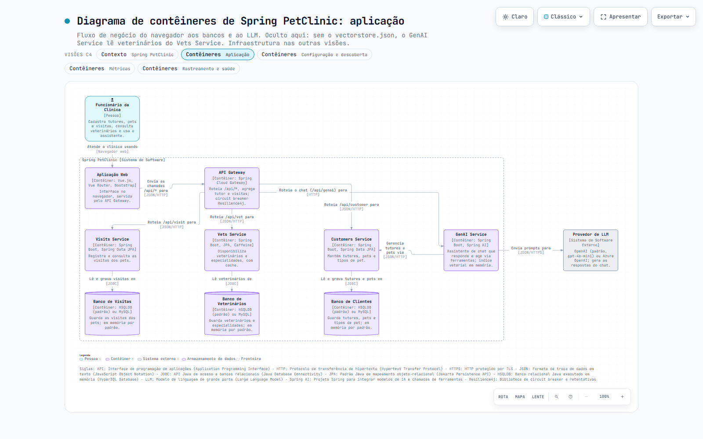
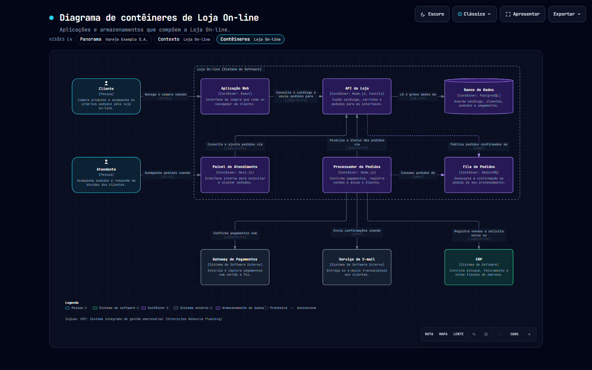

<div align="center">

# c4ify

**C4 model diagrams that follow the notation: validated, drillable, explorable as HTML.**

System Landscape · System Context · Container · Component

[](https://github.com/daniellins/c4ify/actions/workflows/ci.yml)
[](LICENSE)


[](https://github.com/daniellins/bizify)

[Português](README.pt-BR.md) · [Documentation](docs/) · [Contributing](CONTRIBUTING.md) · [Changelog](CHANGELOG.md)

</div>

---

c4ify is an **Agent Skill** (Claude Code and compatible agents) that renders
[C4 model](https://c4model.com) diagrams. You describe a software system once, as one JSON model
of people, software systems, containers, components and relationships; c4ify checks it against the
C4 notation and delivers **one standalone, interactive HTML file per view** (inline SVG, dark/light
themes, pan/zoom, search, focus, guided views, presentation mode and PNG/SVG/WebM export), linked
together so you can drill from the landscape down to components.

> **c4ify is a fork of [bizify](https://github.com/daniellins/bizify)**, itself a fork of
> **[Archify](https://github.com/tt-a1i/archify)** by [tt-a1i](https://github.com/tt-a1i). It keeps
> Archify's viewer, routing and delivery gates and bizify's method-rule engine, and adds the C4
> model. For free-form architecture, sequence or data-flow diagrams use Archify; for business
> diagrams (WBS, BPMN, VSM, …) use bizify. See [Origin and credits](#origin-and-credits).

## Gallery

Real systems, modelled by an agent with c4ify from their public repositories
(sources in [examples/README.md](c4ify/examples/README.md)). Every view passes
`--quality showcase` and fits a 1440×900 screen.

| | |
|---|---|
|  |  |
| **eShop**: system context | **eShop**: containers, order flow (dark theme) |
|  |  |
| **eShop**: components of the Ordering API | **Online Boutique**: containers, checkout flow |
|  |  |
| **Spring PetClinic Microservices** (pt-BR): containers | **Loja On-line** (pt-BR, fictional): containers |

Each model is one JSON file in [`c4ify/examples/`](c4ify/examples/); deliver any of them with
`node bin/c4ify.mjs deliver c4 examples/<model>.c4.json <dir>` and double-click an element marked
⊕ to open the next level.

## Why c4ify

Boxes and arrows are easy; a C4 diagram that a reviewer can trust is not. c4ify encodes the
notation, so **a model that validates follows C4**:

- **The method is the product.** Thirteen rules (`R-C4-01` … `R-C4-13`) paraphrased from the
  c4model.com notation guidance and review checklist, each with a level and a source.
- **HARD rules refuse the model:** a container outside a software system, a view whose scope does
  not match its type, an unlabelled relationship, an arrow from a container to its own system.
- **SOFT rules become advisories:** missing descriptions or technologies, protocol-less
  inter-container calls, unexplained acronyms, vague verbs ("uses"), crowded views. In the
  `showcase` profile they block delivery until fixed or **waived with an explicit reason**.
- **Titles and the key are generated**, so every view says what it is ("Container diagram for
  Online Store") and explains its shapes, colours and line styles.
- **Semantics, not coordinates.** Layout, orthogonal routing and label placement are automatic;
  `placement` and `routes` exist only to repair a named diagnostic.
- **Bilingual viewer.** English by default; `meta.locale: "pt-BR"` localizes the UI, titles, key
  and rule messages.

## One model, many views

Following [Structurizr](https://structurizr.com)'s idea, the model holds every element and
relationship once, and each view asks a question of it at one level of abstraction:

| View type | Scope | Shows |
|---|---|---|
| `systemLandscape` | none | every person and software system |
| `systemContext` | a software system | the system, its users and the systems it talks to |
| `container` | a software system | its containers inside a dashed boundary, plus outside people and systems |
| `component` | a container | its components, plus sibling containers and outside people and systems |

**Implied relationships:** author relationships between the most detailed elements you know. Each
view lifts them to the level it draws (component → component becomes container → container in a
container view, system → system in a context view), merging duplicates with a count.

**Automatic layout:** people on top, the scope in the middle (inside its boundary), stores and
queues in the last boundary row, called systems in a side column; deep views switch to
left-to-right. Labels are placed by a small search, and spacing grows automatically when a label
has no free spot.

**Drill-down:** delivering a model writes `<view-key>.html` for every view into one folder. A
navigation bar links all views, and double-clicking an element marked ⊕ (or Shift+Enter) opens
the next level: landscape → context → containers → components.

## Rules

| Id | Level | Rule |
|---|---|---|
| R-C4-01 | HARD | Hierarchy: a container lives in a software system, a component in a container; people and systems are top-level |
| R-C4-02 | HARD | The view's scope matches its type (none for landscape, a system for context/container, a container for component) |
| R-C4-03 | HARD | Every relationship has a description |
| R-C4-04 | HARD | Relationships connect two distinct elements that are not nested in each other |
| R-C4-05 | HARD | A container or component view zooms into something that has children |
| R-C4-06 | SOFT | Every element has a description |
| R-C4-07 | SOFT | Every container and component names its technology |
| R-C4-08 | SOFT | Relationships between containers name their technology or protocol |
| R-C4-09 | SOFT | Acronyms are explained (`meta.glossary`, shown as a card) |
| R-C4-10 | SOFT | A view stays readable (about 20 elements at most) |
| R-C4-11 | SOFT | Relationship descriptions say what happens, not just "uses" |
| R-C4-12 | SOFT | Every element is drawn by at least one view |
| R-C4-13 | SOFT | A context view shows its users or neighbouring systems |

SOFT findings are warnings in `standard` and block `showcase` unless waived in `meta.waivers` with
a reason. Sources and rationale: [docs/methodology.md](docs/methodology.md) and
[c4ify/references/theory-c4.md](c4ify/references/theory-c4.md).

## Installation

Requirements: **Node.js 18+**. No runtime dependencies; a Chromium-based browser is optional (used
only by `visual-check` for screenshots and containment evidence).

**With the skills CLI** (Claude Code, global):

```bash
npx -y skills add daniellins/c4ify --skill c4ify --agent claude-code --global --copy --yes
```

**Manually:** copy the [`c4ify/`](c4ify/) folder to `~/.claude/skills/c4ify` (user level) or
`.claude/skills/c4ify` (project level), then check it:

```bash
node ~/.claude/skills/c4ify/bin/c4ify.mjs doctor    # → "c4ify is ready."
```

More: [docs/installation.md](docs/installation.md).

## Quick start

Ask your agent in plain language:

```text
"Draw the C4 system context and container diagrams for our online store"
"Model this repository as C4: containers and the components of the API"
"Monte o diagrama de contêineres C4 do sistema de empréstimos da biblioteca"
```

Or drive the CLI directly:

```bash
cd ~/.claude/skills/c4ify
node bin/c4ify.mjs validate c4 examples/online-store.c4.json --quality showcase
node bin/c4ify.mjs deliver  c4 examples/online-store.c4.json out/online-store --quality showcase
node bin/c4ify.mjs deliver  c4 examples/online-store.c4.json out/context.html --view contexto
node bin/c4ify.mjs visual-check out/online-store/panorama.html --json
```

A minimal model with two views:

```json
{
  "schema_version": 1,
  "diagram_type": "c4",
  "meta": { "title": "Internet Banking", "quality_profile": "showcase" },
  "model": {
    "elements": [
      { "id": "customer", "type": "person", "name": "Customer", "description": "A customer of the bank." },
      { "id": "bank", "type": "softwareSystem", "name": "Internet Banking", "description": "Lets customers view balances and make payments." },
      { "id": "web", "type": "container", "parent": "bank", "name": "Web App", "technology": "React", "description": "Banking UI in the browser." },
      { "id": "api", "type": "container", "parent": "bank", "name": "API", "technology": "Java, Spring Boot", "description": "Banking features over JSON/HTTPS." },
      { "id": "db", "type": "container", "parent": "bank", "name": "Database", "technology": "PostgreSQL", "shape": "database", "description": "Stores accounts and transactions." }
    ],
    "relationships": [
      { "from": "customer", "to": "web", "description": "Views balances and pays bills using", "technology": "HTTPS" },
      { "from": "web", "to": "api", "description": "Fetches balances and submits payments via", "technology": "JSON/HTTPS" },
      { "from": "api", "to": "db", "description": "Reads from and writes to", "technology": "SQL/TCP" }
    ]
  },
  "views": [
    { "key": "context", "type": "systemContext", "scope": "bank" },
    { "key": "containers", "type": "container", "scope": "bank" }
  ]
}
```

## CLI

| Command | Does |
|---|---|
| `validate c4 <model> [--view key] [--quality standard\|showcase] [--json]` | Schema, rules and composition gates for every view (or one) |
| `draft c4 <model> <dir> [--view key] [--png] [--json]` | Renders even when layout gates fail: problems outlined in red and listed, optional quick screenshot |
| `deliver c4 <model> <output-dir>` | Atomic delivery of every view as `<view-key>.html`, with SHA-256 receipts |
| `deliver c4 <model> <out.html> --view key` | One view into one file |
| `preview c4 <model> [out.html] [--view key]` | Last-good live preview while editing |
| `check <out.html>` / `visual-check <out.html>` | Artifact checks / browser evidence and screenshots |
| `guide`, `brands`, `examples`, `doctor`, `demo` | Scenario recipes, brand-mark catalogue, examples, install check, demo set |

## How it works

```
model JSON ─▶ schema (AJV, strict) ─▶ HARD rules ─▶ resolve view (scope, implied relationships)
   ─▶ SOFT advisories ─▶ layout ─▶ orthogonal routing ─▶ label placement ─▶ composition gates
   ─▶ inline SVG ─▶ Archify viewer (HTML) ─▶ deliver one file per view (atomic, SHA-256)
```

Details: [docs/architecture.md](docs/architecture.md) · [docs/methodology.md](docs/methodology.md) ·
[docs/adding-a-view-type.md](docs/adding-a-view-type.md).

## Repository layout

```
c4ify/                   the skill (what gets installed)
  SKILL.md               agent instructions
  bin/                   CLI: validate, deliver, preview, visual-check, guide, doctor, demo
  renderers/c4/          resolver, layout, routing, labels, rules, SVG
  renderers/shared/      engine inherited from Archify and bizify
  schemas/               JSON Schemas (2020-12)
  references/            theory-c4.md (notation, rules, sources), authoring and delivery guides
  examples/              validated example models
  assets/template.html   the viewer inherited from Archify
  test/                  node:test suite
docs/                    project documentation
```

## Roadmap

Import from Structurizr (JSON export, then a documented DSL subset), then deployment and dynamic
views. See [ROADMAP.md](ROADMAP.md).

## Contributing

Contributions are welcome: layout and routing improvements, rule corrections backed by the C4
sources, importers, translations and examples. Start with [CONTRIBUTING.md](CONTRIBUTING.md) and
follow the [Code of Conduct](CODE_OF_CONDUCT.md).

## Origin and credits

- **[Archify](https://github.com/tt-a1i/archify)** by **[tt-a1i](https://github.com/tt-a1i)**
  (based on [Cocoon-AI/architecture-diagram-generator](https://github.com/Cocoon-AI/architecture-diagram-generator))
  built the hard parts: the standalone viewer, the deterministic delivery pipeline, the geometry
  and composition gates, the export system, the brand-mark catalogue and the orthogonal router
  that c4ify ports for its relationships.
- **[bizify](https://github.com/daniellins/bizify)** contributed the method-rule engine (HARD/SOFT
  rules, advisories, waivers), the Brazilian Portuguese locale and the repository scaffolding.
  c4ify forked it at commit `7e174b9`.
- **[The C4 model](https://c4model.com)** was created by **Simon Brown**. c4ify's rules paraphrase
  its notation guidance and review checklist (CC BY 4.0).
- **[Structurizr](https://structurizr.com)** inspired the "one model, many views" organization and
  implied relationships.

Full attribution: [NOTICE.md](NOTICE.md) and [c4ify/THIRD_PARTY_NOTICES.md](c4ify/THIRD_PARTY_NOTICES.md).

## License

[MIT](LICENSE) © 2026 Daniel Lins, with the bizify, Archify and Cocoon AI copyright notices preserved.
